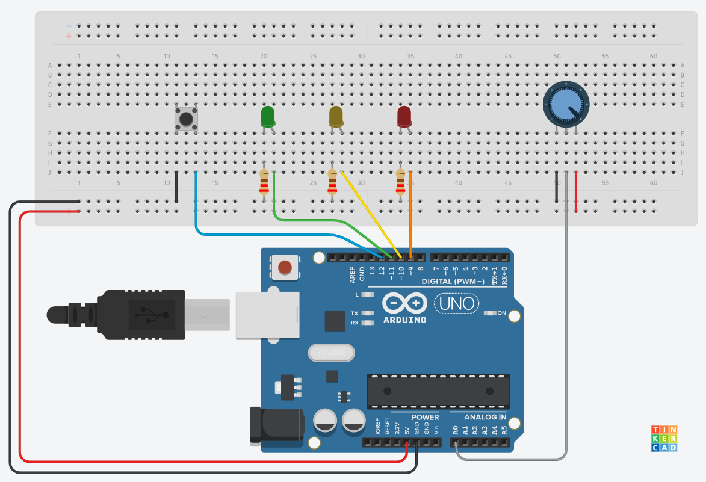
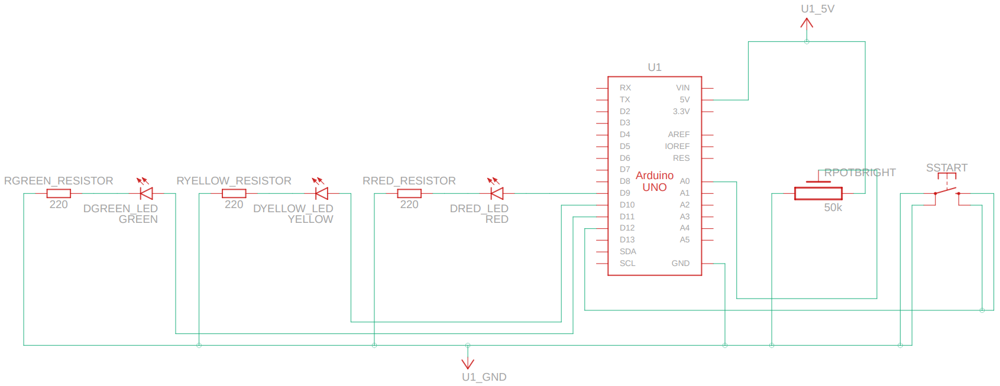
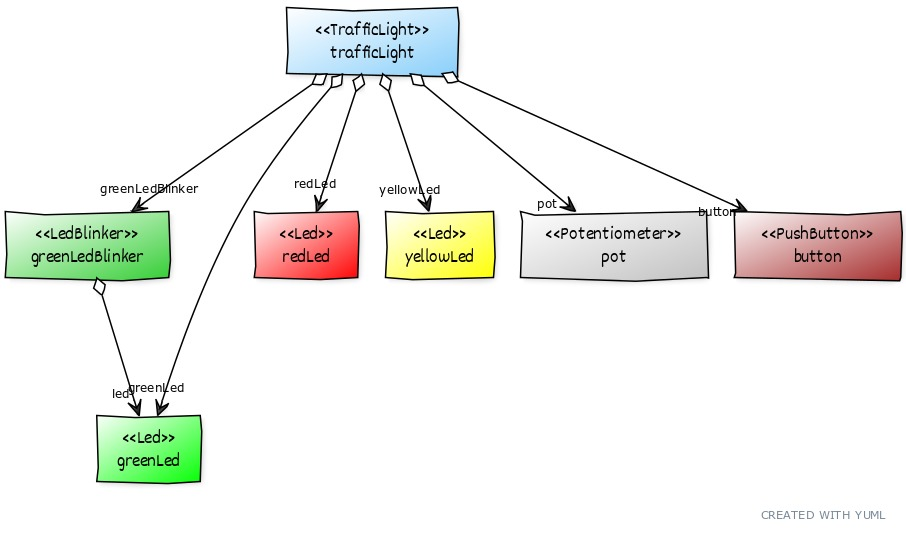

# arduino-traffic-light-v1
Traffic Light with Arduino and OOP - Version 1

This Arduino project was the result of the very good Manning video course by Edouard Renard, ["Arduino OOP"](https://www.manning.com/livevideo/arduino-oop). It was a good refresher for me, and I recommend it to anyone who wants to properly code using object-oriented programming, resulting in a more beautiful and maintainable code.

This is the circuit image:

This is the schematics diagram:

The basic functionality when the Arduino is powered on is as follows:
1. The red LED will light up.
2. To start the cycle, press the button.
3. The yellow LED will light up for a while.
4. The green LED will light up for a while, then it will blink for a little while.
5. The cycle starts again on the red LED.
6. The brightness of the LEDs can be set by adjusting the potentiometer.

The final source code is a bit different from the author's solution, as I made my own improvements. Notably, I used dynamic created objects (using the "new" keyword), instead of static objects.

This is the high-level UML class/object diagram, made with [YUML](https://yuml.me):

Enjoy!

**Adail Retamal**

1-Oct-2022

São Paulo, Brazil
